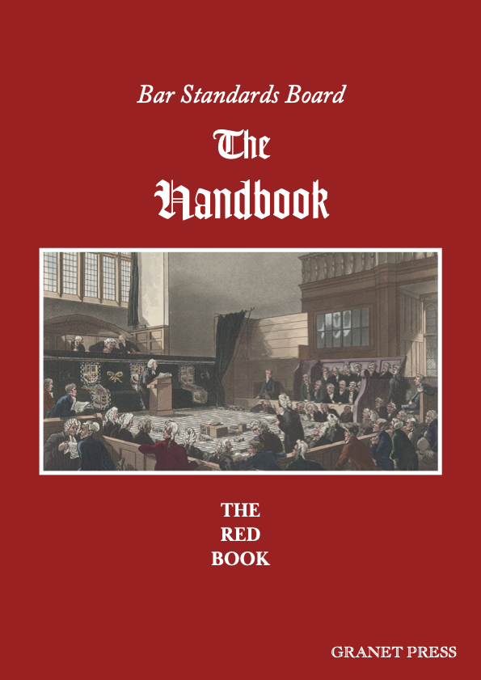

# The Red Book
The Bar Standards Board *Handbook*, but comprehensible!  

[**Click here to download the *Red Book*.**](https://github.com/ezgranet/the-red-book/raw/main/the-red-book.pdf)

For all barristers and students on the Bar Course, the *Handbook* is an indispensible document.  Unfortunately, its official formatting is so terrible as to render its ethical teachings difficult to understand.  I believe one goal of policy should be to make doing good things easier, and therefore it should be easy to read the *Handbook* and follow its ethical pronouncements.

I have made no alterations whatsoever to the integral text of the *Handbook*, so all typographical errors and other strange faults (like using the wrong spelling of 'to practise' at one point, or listing the same provision twice in a row at another) are part of the text handed down from on high.

That is all for most people, but for those who are curious, the source LaTeX is here to play with and alter as you wish.  If you want to compile it, please note you will need my typeface 'Palatine Parliamentary', which you can download for free [by clicking this link](https://github.com/ezgranet/palatine-parliamentary).

